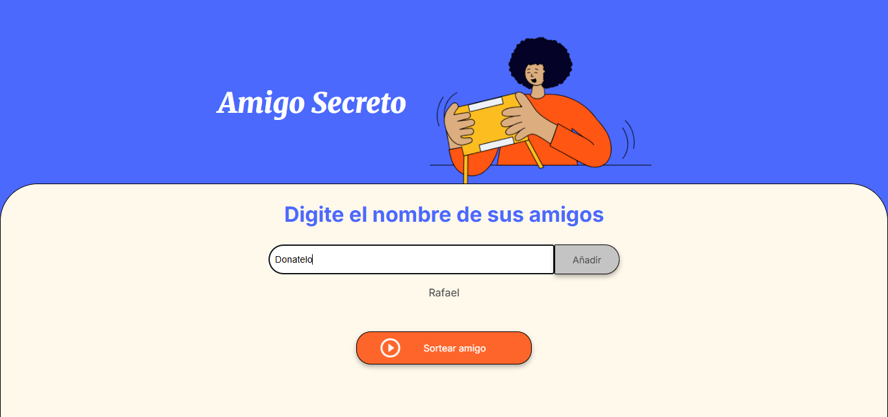
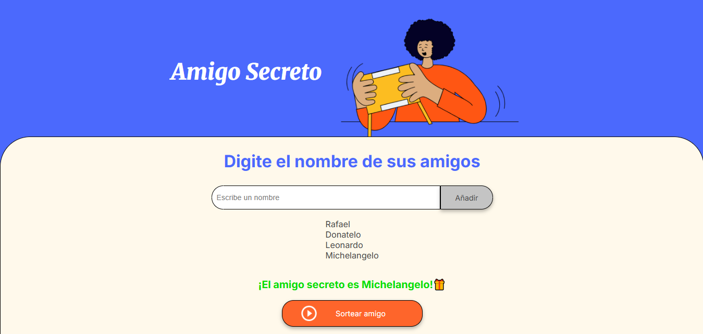

<h1>Challenge Amigo Secreto 🎁</h1>

Este es un proyecto divertido para sortear un amigo secreto entre un grupo de nombres ingresados. La 
aplicación permite a los usuarios ingresar nombres a una lista, y con un click, seleccionar 
aleatoriamente un *amigo secreto*. Es una excelente practica para entender la manipulación de *DOM* 
y la lógica de programación en *JavaScript*.

## 🎯 Funcionalidades
- Agregar amigos
- Actualizar la lista de amigos
- Sorteo aleatorio
- Validación de datos

## 💻 Tecnologías utilizadas
- HTML
- JavaScript
- CSS
- Git

## ✏ Lo aplicado
- `Manipulación del DOM`: tomar datos del usuario desde HTML manipulando con JavaScript.
- `Gestión de arrays`: como agregar elementos y como recorrerlos paramostrarlos.
- `Lógica de sorteo`: utilizar funciones de JavaScript para generar números aleatorios.
- `Modularidad de funciones`: al crear funciones el código se volvio más limpio y fácil de mantener.
- `Validación de datos`: incluir validaciones simples ayuda al usuario a prevenir errores y mejorar su experiencia.

## 🎮 Funcionamiento
- **Agregar Amigos**
Para agregar los nombres se debe escribir en la caja de texto en blanco y presionar el botón "Añadir". 

Después de ingresar todos los nombres se debe presionar en el botón "Sortear amigo" para obtener el nombre del amigo secreto.
- **Resultado Sorteo**
